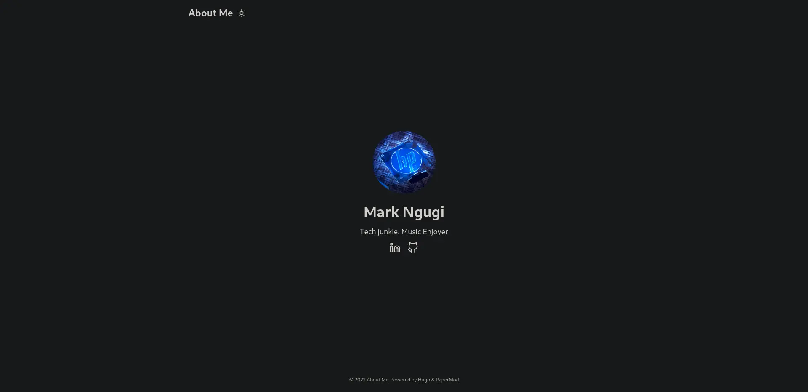
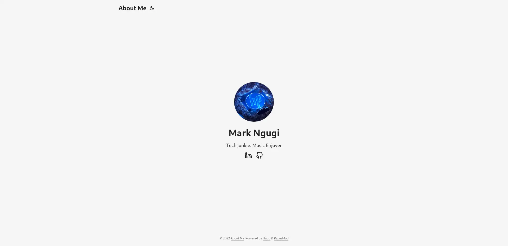

# Hugo Profile Page 
This is the config to generate the hugo site [here](https://mark26745.github.io/)

The theme used is [PaperMod](https://github.com/adityatelange/hugo-PaperMod/)

# Screenshots

